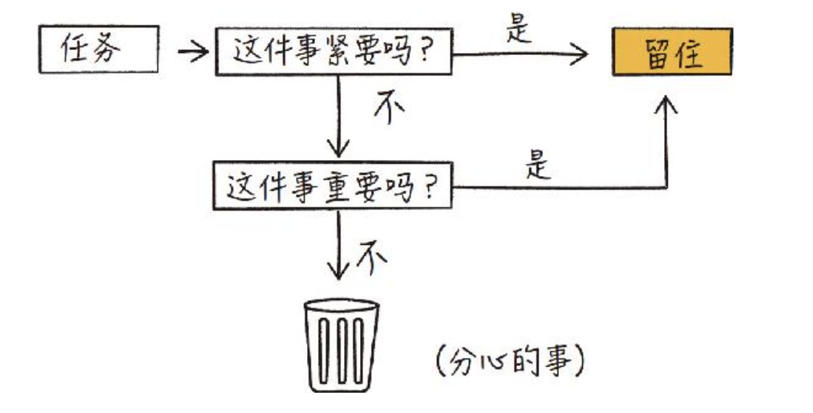

# 概述
讲解了作者从慢阅读状态到快速阅读的方法和技巧。

## 笔记

> 第一章第二节(承诺)

```
有了子弹笔记术的帮助，你能够花费更少的时间和精力换来更大的成就。子弹笔记将帮助你识别并剔除无意义的事，从而专注于有意义的事。
```

## 精华

> 第一章第一节(阅读熟读缓慢的人普遍执着于一个问题)

```
总有些内容会留在记忆的某个角落，至少，这一部分对自己来说是有用的。
读书的收货，正在于此。通读一本书的意义就在于邂逅这些部分---我相信，这样的说法并不为过。
```

> 第一章第五节(整理想法)

```
我们需要减少强加于自身的决策，如此才能专注于重要的事务。
```

> 第一章第六节(笔记本)

```
无论是 App 还是其他类似物，最终都是工具，而只有方便我们完成任务的工具才是有价值的。
```


> 第一章第七节(动手写字))

```
我的一位密友曾经对我说：「长路即捷径。」在当今这个追求速度的时代，我们常常错误地把快捷当成效率。然而当我们走捷径时，失去的是放慢脚步思考的机会。尽管动手写字这一方式陈旧而复古，我们却可以借此抓住慢慢思考的机会。每当我们一笔一画地书写时，我们便自动把有价值的信息从喧嚣中摘选了出来。真正的效率无关速度，而在于为真正重要的事情留出了多少时间。这便是子弹笔记的要义所在。
```


## 评论
书籍本身讲解的是读书技巧，但是作者在谈论读书心态的转变打动了我，
除了获取知识，读书本身就是一趟旅行，你应该满含期待的上路，去从作者的思维中发现令你动容的风景，这本身就是一种幸福，保有第一次听到一首好歌，看到片美景的惊讶和喜悦，那么读书与你变成了一场内容的邂逅，充满惊喜。除了人文书籍，实际上自然科学的书籍也能可以产生这样的触动，一个奇妙的公式。你不知道的技术细节这些也都是风景，所以转变心态再加恰当的技巧，你会从书籍中收获更多快乐。

## 总结

1. 避免决策疲劳导致的决策规避，划分任务优先级，
   1. 归类事情
      1. DOING 正在做的
      2. TODO 准备做的
      3. PLAN 所有的计划
   2. 采用如下决策树确定优先级，事情四象限
      

   3. 划掉未留住的任务，保持专注，不要让其他任务分心