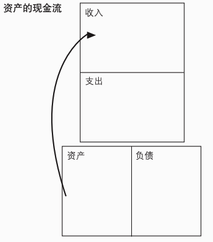
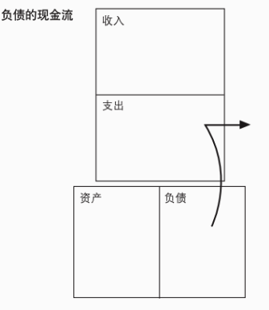

# 收获总览
## 资产和负债
**资产**

**负债**

典型的资产包括
1. 无需我管理的业务
2. 股票
3. 债券
4. 共同基金
5. 能够产生收入的房地产
6. 票据
7. 版税,如音乐,手稿,专利
8. 其他任何有价值、可产生收入或有增值潜力并且有很好销路的东西(收藏等)

> 重点是投资资产,降低负债

## 财商(FinancialI.Q)
1. 财务知识,阅读理解数字的能力
2. 投资策略,以钱生钱的科学
3. 市场,供给与需求
4. 法律规章

> 在游戏规则之内创造财富

投资者分类
1. 一揽子投资者,将资产交给他人打理
2. 创造性投资者,自行组合投资策略

创造性投资者的特质:

1. 信息不对称下,获取机会的能力
2. 增加资金的手段
3. 合理的资源调配,将精明的人组织起来

## 书评
作者通过大量示例讲解了富人的思维模式。
总结如下:增加资产,减少负债。

